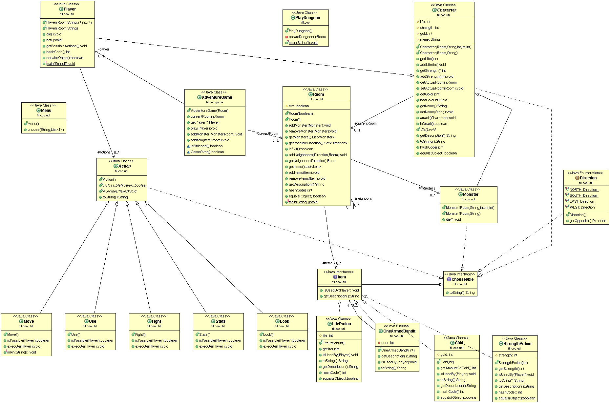

# Projet Donjon
---------------
*Auteurs: Santi - Legrand*

## Sujet  
Le but de ce projet était de créer un jeu de donjon au tour par tour sous format texte, codé en java, jouable sur terminal de commande pour un joueur.  

Le joueur commence dans une salle et se voit proposer plusieurs options selon les possiblités présentent dans la salle.
Le joueur peut toujours regarger dans la salle pour indiquer ce qui si trouve (option _Look_). Il a aussi toujours accès à ses statistiques (option _Stats_).  
Si la salle ne contient pas de monstres, le joueur peut se déplacer vers une salle suivante (option _Move_) parmi au maximum 4 choix (NORTH, WEST, SOUTH, EAST), si une seule direction est disponible, le déplacement se fait automatiquement.  
Si un ou plusieurs monstres sont présents, le joueur doit combattre (option _Fight_) jusqu'à ce qu'il tue tous les monstres pour pouvoir ensuite se déplacer ou soit tué. Les monstres ne réapparaissent pas après avoir été tuer.  
Si la salle contient un objet, le joueur peut le ramasser avec l'option _Use_. Les monstres peuvent faire tomber de l'or, qui peut ensuite servir à acheter un objet aléatoire au bandit manchot (apparait parfois dans les salles, interagit comme un objet).

Pour gagner la partie, le joueur doit arriver dans la dernière salle du donjon, il ne saura s'il a gagné que lorsqu'il l'aura atteinte et tuer les monstres qui y sont présents.  


## Howto  
    git pull  
    cd donjon/
    mvn javadoc:javadoc  (le chemin pour la documentation est target/docs/index.html)  
    mvn package  
    java -jar target/donjon-1.0-SNAPSHOT.jar Player1  

## Snippet de code

Comment a été codé la partie de l'exécutable

````java
public class PlayDungeon {
	private Room createDungeon(){
		Room r1 = new Room();
		Room r2 = new Room();
		Room r3 = new Room();
		Room r4 = new Room();
		Room r5 = new Room(true);
		Monster m1 = new Monster(r2,"Rick",5,5,100);
		Monster m2 = new Monster(r5,"Morty",20,20,0);
		r1.addNeighboors(Direction.WEST, r2);
		r1.addNeighboors(Direction.SOUTH, r3);
		r1.addNeighboors(Direction.EAST, r4);
		r4.addNeighboors(Direction.EAST, r5);
		AdventureGame game = new AdventureGame(r1);
		game.addItem(new StrengthPotion(10), r2);
		game.addItem(new LifePotion(50), r3);
		game.addItem(new Gold(50), r4);
		game.addItem(new OneArmedBandit(10), r1);
		return r1;
	}
	public static void main(String[] args) {
		AdventureGame game = new AdventureGame(new PlayDungeon().createDungeon());
		Player p = new Player(game.currentRoom(),args[0],10,10,10);
		game.play(p);
	}
}
````

## Diagrammes UML

